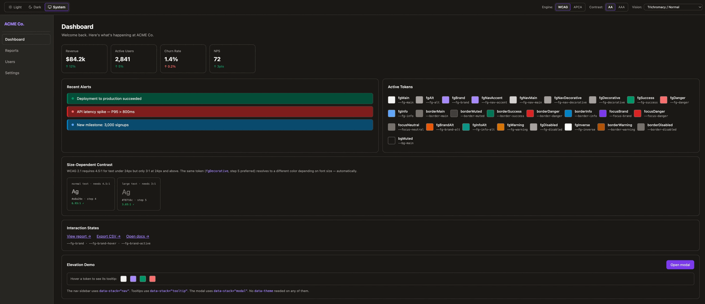

# gamut-all



Design tokens that are automatic.

Most token systems are hand-curated for every single state, with every possible combination. gamut-all automates that work. Define your ramps. Name your themes and surfaces. It finds the right color for every context — background, elevation, vision mode — and guarantees WCAG AA/AAA compliance at build time. If a specified step doesn't work, it will choose the next closest color that maps properly. No more semantic token soup.

**How it works.** You define color ramps (ordered arrays of hex or OKLCH values) and name your themes and surfaces. The engine evaluates every token × surface × font size × elevation × vision mode combination at build time and emits a flat CSS custom properties file. At runtime, `data-theme`, `data-stack`, and `data-vision` attributes on DOM elements activate the right values through the CSS cascade — no JavaScript required for standard usage.

**What's possible.**

- **Themes** — `data-theme="light"` / `"dark"` / any named theme switches the full token set automatically
- **Surfaces** — Named background colors (`bgBrand`, `bgDanger`, `bgMain`) emitted as `--bg-*` CSS vars, with hover/active states and automatic dark-theme adaptation
- **Elevation** — `data-stack="card"` / `"modal"` / `"tooltip"` shifts the surface one or more ramp steps and re-resolves every token against the new surface
- **CVD simulation** — Automatic hue-shifted variants for six color vision deficiency types, applied to both semantic tokens and surface backgrounds. Zero configuration required.
- **Compliance** — WCAG 2.1 or APCA; AA or AAA; verified at build time with a CLI coverage report showing exactly which ramp steps pass on which surfaces
- **Contextual overrides** — Surgical overrides for specific backgrounds, font sizes, or stack levels when auto-resolution needs a hint

---

## vs. Standard Semantic Token Systems

| | Standard tokens | gamut-all |
|---|---|---|
| Define each theme variant | ✗ manually | ✓ automatic |
| Define each elevation variant | ✗ manually | ✓ automatic |
| Surface dark-theme adaptation | ✗ manually | ✓ auto-mirrors across ramp midpoint |
| Surface hover/active states | ✗ separately defined | ✓ inline `interactions` |
| Define vision mode overrides | ✗ manually | ✓ auto-generated via CVD simulation |
| Compliance checked | ✗ manually or not at all | ✓ at build time, every variant |
| New surface added | ✗ update every token | ✓ update one surface entry |
| Ramp color changed | ✗ audit all downstream tokens | ✓ re-run build |
| Coverage visibility | ✗ none | ✓ `gamut-audit --report coverage` |

---

## Installation

### For Humans

```bash
pnpm add @gamut-all/core
```

Add the Vite plugin:

```ts
// vite.config.ts
import { designTokensPlugin } from '@gamut-all/core/vite';

export default defineConfig({
  plugins: [
    designTokensPlugin({
      input: './tokens.json',
      outputDir: './src/generated',
      emitTypes: true,
      emitCSS: true,
    }),
  ],
});
```

Import the generated CSS in your entry point:

```ts
import './generated/tokens.css';
```

For React:

```bash
pnpm add @gamut-all/react
```

### For LLM Agents

The schema is the source of truth for the `tokens.json` structure. You can find it in `@gamut-all/core/schema.json`.

---

## tokens.json

One file drives everything.

```json
{
  "$schema": "node_modules/@gamut-all/core/schema.json",
  "config": {
    "wcagTarget": "AA",
    "complianceEngine": "wcag21",
    "defaultTheme": "light"
  },
  "primitives": {
    "slate": ["#f8fafc", "#f1f5f9", "#e2e8f0", "#cbd5e1", "#94a3b8",
              "#64748b", "#475569", "#334155", "#1e293b", "#0f172a", "#020617"],
    "blue":  ["#eff6ff", "#dbeafe", "#bfdbfe", "#93c5fd", "#60a5fa",
              "#3b82f6", "#2563eb", "#1d4ed8", "#1e40af", "#1e3a8a", "#172554"],
    "emerald": ["#ecfdf5", "#d1fae5", "#a7f3d0", "#6ee7b7", "#34d399",
                "#10b981", "#059669", "#047857", "#065f46", "#064e3b", "#022c22"]
  },
  "themes": {
    "light": { "ramp": "slate", "step": 0, "fallback": ["dark"] },
    "dark":  { "ramp": "slate", "step": 10, "fallback": ["light"] }
  },
  "surfaces": {
    "bgMain":    { "ramp": "slate",   "step": 1,
                   "interactions": { "hover": { "step": 2 }, "active": { "step": 3 } } },
    "bgInverse": { "ramp": "slate",   "step": 10 },
    "bgBrand":   { "ramp": "blue",    "step": 5 },
    "bgSuccess": { "ramp": "emerald", "step": 6 },
    "bgSuccessMuted": { "ramp": "emerald", "step": 1 }
  },
  "foreground": {
    "fgPrimary": { "ramp": "slate", "defaultStep": 10 },
    "fgLink": {
      "ramp": "blue",
      "defaultStep": 6,
      "interactions": { "hover": { "step": 8 }, "active": { "step": 9 } }
    }
  },
  "nonText": {
    "borderAction": { "ramp": "blue", "defaultStep": 5 }
  }
}
```

Use in markup:

```html
<!-- Theme -->
<html data-theme="dark">

<!-- Elevation — cascades from the ancestor -->
<div data-stack="card">
  <div data-stack="modal">

<!-- Vision mode — hue-shifted tokens applied automatically -->
<div data-vision="protanopia">
```

---

## Surfaces

Surfaces are named background colors — `bgBrand`, `bgMain`, `bgDanger`, etc. They are emitted as `--bg-*` CSS custom properties and adapt to dark themes automatically.

### Generated CSS

```css
:root {
  --bg-main: #f1f5f9;         /* slate step 1 */
  --bg-main-hover: #e2e8f0;   /* slate step 2 */
  --bg-main-active: #cbd5e1;  /* slate step 3 */
  --bg-success-muted: #ecfdf5; /* emerald step 1 */
}

[data-theme="dark"] {
  --bg-main: #1e293b;          /* auto-mirrored: step 10-1 = step 9 */
  --bg-main-hover: #334155;    /* auto-mirrored: step 10-2 = step 8 */
  --bg-main-active: #475569;   /* auto-mirrored: step 10-3 = step 7 */
  --bg-success-muted: #064e3b; /* auto-mirrored: emerald step 10-1 = step 9 */
}
```

### Auto-mirroring

When a theme has `elevationDirection === 'lighter'` (i.e. the theme step is above the ramp midpoint — dark themes), every surface is automatically mirrored across the ramp midpoint using the formula:

```
mirroredStep = (rampLength - 1) - declaredStep
```

This applies to all ramps, not just the theme's ramp. A muted emerald surface (step 1) on a dark theme becomes a dark emerald tint (step 9). A light stone card (step 1) becomes a dark stone card (step 9). No manual dark overrides needed.

Interaction states (`hover`, `active`) are mirrored using the same formula, independently of the base step.

### Explicit theme overrides

Override the auto-mirror for any surface by declaring a `themes` map:

```json
"bgInverse": {
  "ramp": "slate",
  "step": 10,
  "themes": { "dark": { "step": 0 } }
}
```

The explicit override takes full precedence over auto-mirroring.

### `surfaces` fields

| Field | Description |
|---|---|
| `ramp` | Source ramp |
| `step` | Default step index |
| `interactions` | Named states (`hover`, `active`, etc.) each with their own `step` |
| `themes` | Per-theme step overrides — overrides auto-mirroring for that specific theme |

---

## Configuration

### `config`

| Field | Default | Description |
|---|---|---|
| `wcagTarget` | `"AA"` | Minimum contrast level — `"AA"` or `"AAA"` |
| `complianceEngine` | `"wcag21"` | `"wcag21"` (ratio) or `"apca"` (Lc value) |
| `defaultTheme` | first theme key | The theme whose values are written to `:root` |
| `stepSelectionStrategy` | `"closest"` | `"closest"` or `"mirror-closest"` — how to find the nearest passing step when the default fails |
| `onUnresolvedOverride` | `"warn"` | What to do when a manual override fails compliance: `"warn"` or `"error"` |
| `stacks` | `{ root: 0 }` | Elevation offsets per stack level, e.g. `{ card: 1, modal: 2 }` |
| `cvd` | see below | Color Vision Deficiency simulation options |

### `cvd` options

| Field | Default | Description |
|---|---|---|
| `enabled` | `true` | Set to `false` to disable all CVD variant generation |
| `confusionThresholdDE` | `5` | Hue ΔE below which two colors are considered confused under simulation |
| `distinguishableThresholdDE` | `8` | Hue ΔE above which two colors are considered distinguishable without simulation |

### `themes`

| Field | Description |
|---|---|
| `ramp` | Which primitive ramp to use |
| `step` | Index into the ramp (0 = lightest by convention) |
| `fallback` | Other themes to inherit from when a token has no entry for this one |
| `aliases` | Alternate names for this theme |

### `foreground` / `nonText` (Tokens)

| Field | Description |
|---|---|
| `ramp` | Source ramp for this token |
| `defaultStep` | Preferred step — omit to use the ramp midpoint |
| `decorative` | If `true`, WCAG contrast checks are bypassed (graphical/decorative use) |
| `interactions` | Named interaction states (`hover`, `active`, `focus`) each with `step` and optional `overrides` |
| `overrides` | Array of context-specific overrides targeting `bg`, `fontSize`, and/or `stack` |

---

## Color Vision Deficiency (CVD)

gamut-all automatically generates hue-shifted token and surface variants for users with color vision deficiency. No additional configuration is required — it runs at build time and activates via `data-vision`.

### How it works

1. **Simulate** — Every token's hex is run through a CVD simulation matrix (Viénot 1999 / Brettel 1997 HPE pipeline) for each of the six supported types.
2. **Detect confusion** — Pairs of tokens that are distinguishable in normal vision but fall below the hue ΔE confusion threshold under simulation are flagged.
3. **Shift hues** — Affected tokens are shifted to a safe hue zone that remains distinguishable under that CVD type. The hue target is determined by a per-CVD policy table mapping source hue bands to target hue zones.
4. **Compliance check** — The shifted hex is tested against the surface for contrast compliance. If it fails, ramp steps are walked outward from the default and the first compliant shifted step is used. If none pass, no CVD variant is emitted for that token.
5. **Surfaces** — The same confusion detection and hue-shift logic runs over surfaces, writing `visionOverrides` that appear in `[data-vision="X"]` blocks.

### Supported types

| `data-vision` value | Type |
|---|---|
| `protanopia` | Red-blind (L cone absent) |
| `protanomaly` | Red-weak (L cone shifted) |
| `deuteranopia` | Green-blind (M cone absent) |
| `deuteranomaly` | Green-weak (M cone shifted) |
| `tritanopia` | Blue-blind (S cone absent) |
| `tritanomaly` | Blue-weak (S cone shifted) |

Achromatopsia and blue cone monochromacy are not hue-shifted (full grayscale vision requires pattern/icon changes that CSS cannot provide).

### Generated CSS

CVD variants are generated for **semantic tokens only** (foreground text, borders, focus rings). Surface backgrounds are intentionally excluded — shifting a surface hue would destroy its semantic meaning and invalidate the contrast of every token placed on top of it. The foreground tokens on those surfaces are already shifted to remain distinguishable.

```css
/* Normal vision — default hues */
:root {
  --fg-success: #16a34a;
  --fg-danger:  #dc2626;
}

/* Protanopia — red/green hues shifted to blue/violet zone */
[data-vision="protanopia"] {
  --fg-success: #1d6fa8;
  --fg-danger:  #7c3aed;
}
```

### Opt out

```json
"config": {
  "cvd": { "enabled": false }
}
```

### Hue band policy

| CVD type | Confused bands | Shifted to |
|---|---|---|
| Protanopia / Protanomaly | Red (0°–90°) → Blue zone (230°–270°) | — |
| — | Green/teal (90°–200°) → Violet zone (295°–335°) | — |
| Deuteranopia / Deuteranomaly | Same bands as protanopia | Same targets |
| Tritanopia / Tritanomaly | Yellow/amber (60°–110°) → Orange/red (15°–45°) | — |
| — | Blue/cyan (190°–270°) → Violet (280°–320°) | — |

When multiple ramps fall into the same confused band, their target hues are spread proportionally across the target range (sorted by original median hue) so they remain distinguishable from each other. Overflow ramps that exceed the range capacity have their chroma progressively reduced by 25% per overflow rank.

---

## React Components & Hooks

The `@gamut-all/react` package provides tools for using tokens in React applications.

- **`TokenProvider`** — Top-level provider that manages the token registry and context.
- **`TokenizedText`** — Automatically applies the correct foreground token and font-size context.
- **`StackLayer`** — Increments `data-stack` and updates the internal elevation context.
- **`useToken(tokenName)`** — Resolves a token value for the current context.
- **`useTokenVars()`** — Returns all token values as a CSS-variable-compatible object.
- **`withAutoContrast(Component)`** — HOC that ensures children meet contrast requirements.

---

## Commands

### Workspace

```bash
pnpm build      # build all packages
pnpm test       # run all tests
pnpm typecheck  # typecheck all packages
```

### Audit CLI

```bash
# Check every variant passes compliance — exits 1 on failure
gamut-audit --registry ./dist/registry.json

# Coverage report — passing step ranges per token × surface
gamut-audit --registry ./dist/registry.json --report coverage

# Audit a static HTML file against the registry
gamut-audit --registry ./dist/registry.json --html ./dist/index.html
```

---

## Packages

| Package | Description |
|---|---|
| [`@gamut-all/core`](./packages/core) | Token processing, registry, CSS generation, Vite plugin |
| [`@gamut-all/react`](./packages/react) | `TokenProvider`, `StackLayer`, hooks, automatic contrast components |
| [`@gamut-all/audit`](./packages/audit) | `gamut-audit` CLI for CI/CD compliance auditing |
